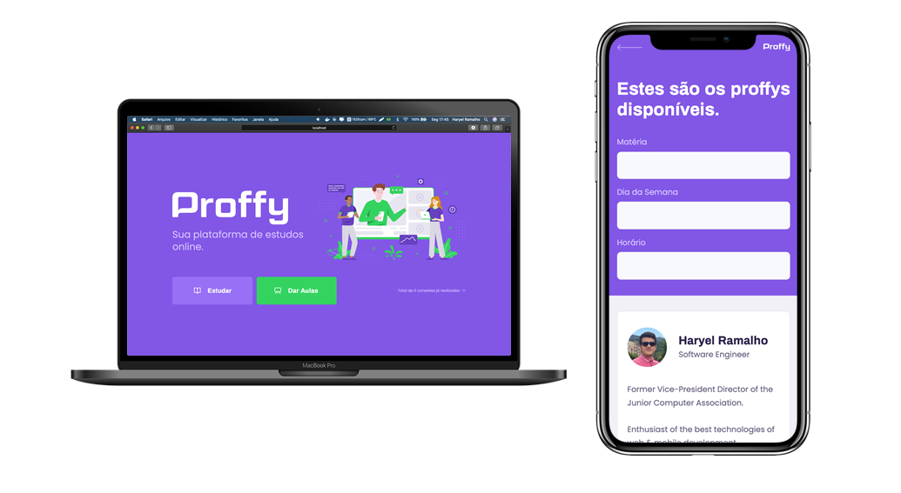

<!-- <div align="center">
  

  :rocket: *An online study plataform that promises to connect students to teachers in any area of knowledge*

</div>

<p align="center">
  <a href="https://www.linkedin.com/in/haryelramalho/"></a>
  
  <a href="https://github.com/haryelramalho/nlw2-proffy/commits/main"></a>
  
</p>

<div align="center">
  
</div>


# :pushpin: Table of contents

- [Technologies](#computer-technologies)
- [How to run](#construction_worker-how-to-run)
- [License](#closed_book-license)

# :computer: Technologies

This project was made using the following technologies:

<ul>
  <li><a href="https://nodejs.org/en/docs/">NodeJs</a></li>
  <li><a href="https://www.typescriptlang.org/">Typescript</a></li>
  <li><a href="https://pt-br.reactjs.org/">React</a></li>
  <li><a href="https://reactnative.dev/">React Native</a></li>
  <li><a href="https://expo.io/">Expo</a></li>
</ul>

# :construction_worker: How to run

### :computer: Downloading project 

```bash
# Clone repository into your machine
$ git clone https://github.com/haryelramalho/nlw2-proffy.git
```

### 💻 Running project on a web browser

```bash
# Go to project's web folder
$ cd web/

# Install dependencies
$ yarn install or npm install

# Run application
$ yarn start or npm run start
```

Application located on http://localhost:3000/.

### 📱 Running project on mobile

To run the project on mobile you need a cellphone with the [expo](https://play.google.com/store/apps/details?id=host.exp.exponent) app instaled or an android/ios emulator.

After forking this repository and making a clone of it in your machine, run the following commands inside the project folder :

```bash
# Go to mobile folder
$ cd mobile/

# Install dependencies
$ yarn install  or npm install

# Run application
$ yarn start or npm run start
```

# :closed_book: License

Released in 2020.

This project is under the [MIT license](https://github.com/haryelramalho/nlw2-proffy/blob/master/LICENSE).

Give it a ⭐️ if this project helped you! -->

<h1 align="center">
    
</h1>

<h3 align="center">
  An online study plataform that promises to connect students to teachers in any area of knowledge
</h3>

<p align="center">
  <a href="https://www.linkedin.com/in/haryelramalho/"></a>
  
  <a href="https://github.com/haryelramalho/nlw2-proffy/commits/master"></a>
  
</p>

<p align="center">
  <a href="#-about-the-project">About the project</a>&nbsp;&nbsp;&nbsp;|&nbsp;&nbsp;&nbsp;
  <a href="#-technologies">Technologies</a>&nbsp;&nbsp;&nbsp;|&nbsp;&nbsp;&nbsp;
  <a href="#-getting-started">Getting started</a>&nbsp;&nbsp;&nbsp;|&nbsp;&nbsp;&nbsp;
  <a href="#-how-to-contribute">How to contribute</a>&nbsp;&nbsp;&nbsp;|&nbsp;&nbsp;&nbsp;
  <a href="#-license">License</a>
</p>

<p id="insomniaButton" align="center">
  <a href="https://insomnia.rest/run/?label=Proffy&uri=https%3A%2F%2Fgithub.com%2Fharyelramalho%2Fnlw2-proffy%2Fblob%2Fmaster%2FInsomnia.json" target="_blank">
    
  </a>
</p>

<p align="center">
  
</p>

## 🧸 About the project

This project was developed on the Next Level Week #02 event by [Rocketseat](https://rocketseat.com.br/) 🚀&nbsp;💜

Happy is an application that connects people to institutional care homes to make many children's day happier

## 🚀 Technologies

Technologies that I used to develop this application

- [Node.js](https://nodejs.org/en/)
- [ReactJS](https://reactjs.org/)
- [React Native](https://reactnative.dev/)
- [TypeScript](https://www.typescriptlang.org/)
- [Expo](https://expo.io/)
- [Knex](http://knexjs.org/)
- [SQLite](https://www.sqlite.org/index.html)
- [Express](https://expressjs.com/pt-br/)
- [Axios](https://github.com/axios/axios)
- [React Router DOM](https://reacttraining.com/react-router/)
- [React Navigation](https://reactnavigation.org/)

## 💻 Getting started

Import the `Insomnia.json` on Insomnia App or click on [Run in Insomnia](#insomniaButton) button

### Requirements

- [Node.js](https://nodejs.org/en/)
- [Yarn](https://classic.yarnpkg.com/)
- [Expo](https://expo.io/)

```bash
$ git clone https://github.com/haryelramalho/nlw2-proffy.git && cd nlw-3
```

**Follow the steps below**

### Backend

```bash
# Starting from the project root folder, go to backend folder
$ cd backend

# Install the dependencies
$ yarn

# Use the script to run the migrations
$ yarn knex:migrate

# To finish, run the api service
$ yarn start

# Well done, project is started!
```

### Web

_Obs.: Before to continue, be sure to have the API running_

```bash
# Starting from the project root folder, go to web folder
$ cd web

# Install the dependencies
$ yarn

# Be sure the file 'src/services/api.ts' have the IP to your API

# Start the client
$ yarn start
```

### Mobile

_Obs.: Before to continue, be sure to have the API running_

```bash
# Starting from the project root folder, go to mobile folder
$ cd mobile

# Be sure the file 'src/services/api.ts' have the IP to your API

# Start the expo service and scan the QR code with Expo Client
$ yarn start
```

## 🤔 How to contribute

**Make a fork of this repository**

```bash
# Fork using GitHub official command line
# If you don't have the GitHub CLI, use the web site to do that.

$ gh repo fork haryelramalho/nlw2-proffy
```

**Follow the steps below**

```bash
# Clone your fork
$ git clone your-fork-url && cd nlw2-proffy

# Create a branch with your feature
$ git checkout -b my-feature

# Make the commit with your changes
$ git commit -m 'feat: My new feature'

# Send the code to your remote branch
$ git push origin my-feature
```

After your pull request is merged, you can delete your branch

## 📝 License

This project is licensed under the MIT License - see the [LICENSE](LICENSE) file for details.

---

Made with 💜&nbsp; by Haryel 👋 &nbsp;[See my linkedin](https://www.linkedin.com/in/haryelramalho/)
